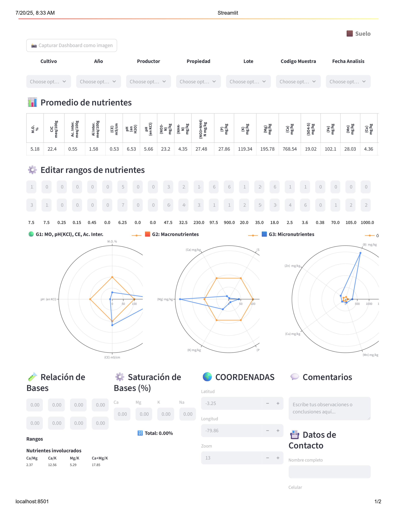
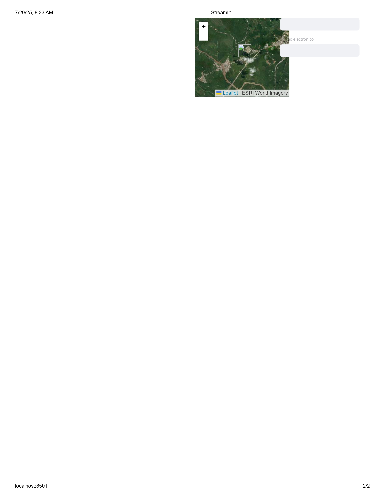

# 🧪 Dashboard de Análisis de Nutrientes – Suelo y Foliar

Este es un sistema interactivo construido con **Python y Streamlit** para el análisis, visualización y captura de datos de **nutrientes del suelo y foliar**. Está pensado para ser escalable, modular y aplicable a contextos agrícolas reales en Ecuador u otras regiones.

## 🌱 Características principales

- 📁 Subida de archivos Excel con datos de análisis de suelo y foliar
- 🎯 Filtros dinámicos por cultivo, año, productor, lote, etc.
- 📊 Cálculo y visualización de promedios de nutrientes
- ⚙️ Tablas editables de rangos de referencia
- 📈 Gráficos radiales comparativos (valores óptimos vs. DOP)
- 🔄 Relación de bases: cálculos automáticos con fórmulas específicas
- 🧮 Saturación de bases con porcentajes ajustables
- 💬 Sección de comentarios técnicos y contacto
- 🌍 Mapa con coordenadas (ESRI World Imagery)
- 📸 Captura del panel en PNG y PDF desde un solo botón

## 📸 Vista previa del Panel

### Panel de Análisis del Suelo





## 🗂️ Estructura del proyecto

```
dashboard/
│
├── app.py                       # Punto de entrada principal (llama a los paneles)
├── captura_dashboard.py        # Captura automática del dashboard como imagen/PDF
│
├── modules/
│   ├── panel_suelo.py          # Panel de análisis del suelo
│   ├── panel_foliar.py         # (Próximamente) Panel foliar
│   ├── graficos.py             # Gráficos radiales
│   ├── tablas.py               # Lógica de tablas editables y promedios
│   ├── filtros.py              # Filtros dinámicos
│   ├── mapa.py                 # Componente del mapa con lat/long
│   ├── secciones_adicionales.py # Comentarios, contacto, etc.
│   ├── nutrientes.py           # Mapeos y constantes
│   ├── utils.py                # Cálculos de DOP y relaciones de bases
│   └── captura.py              # Botón para ejecutar capturas
│
├── assets/
│   └── styles.css              # Estilos personalizados
│
├── data/                       # (Opcional) Carpeta para datos de prueba
└── README.md                   # Este archivo
```

## 🚀 Instalación

1. Clona este repositorio:

```bash
git clone https://github.com/RichardSucuy/dashboard-analisis-nutrientes.git
cd dashboard-analisis-nutrientes
```

2. Crea un entorno virtual:

```bash
python -m venv venv
venv\Scripts\activate     # En Windows
```

3. Instala las dependencias:

```bash
pip install -r requirements.txt
```

4. Ejecuta la app:

```bash
streamlit run app.py
```

---

## 📸 Captura automática

El botón "📸 Capturar Dashboard como imagen" permite generar:

- `dashboard.png` con Selenium
- `dashboard.pdf` (requiere [wkhtmltopdf](https://wkhtmltopdf.org/))

Ambas capturas se guardan automáticamente en la raíz del proyecto.

---

## 🧠 Escalabilidad

El código está modularizado, lo que permite fácilmente:

- Añadir un nuevo **panel foliar**
- Usar otras fuentes de datos (base de datos, APIs)
- Personalizar estilos desde `styles.css`
- Reutilizar componentes como gráficos, mapa o tablas

---

## 📌 Requisitos

- Python 3.8+
- Navegador Chrome (para Selenium)
- wkhtmltopdf (opcional para PDF)

---


## 📃 Licencia

Este proyecto está licenciado bajo los términos de la MIT License.